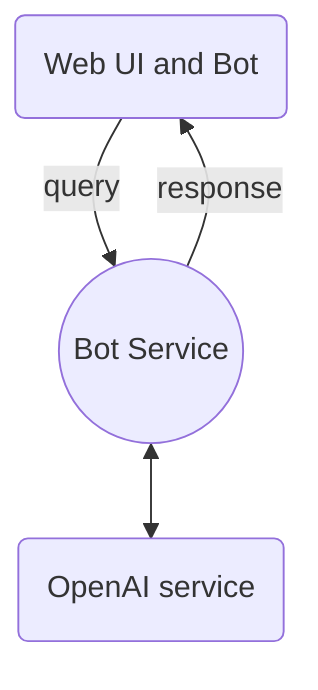
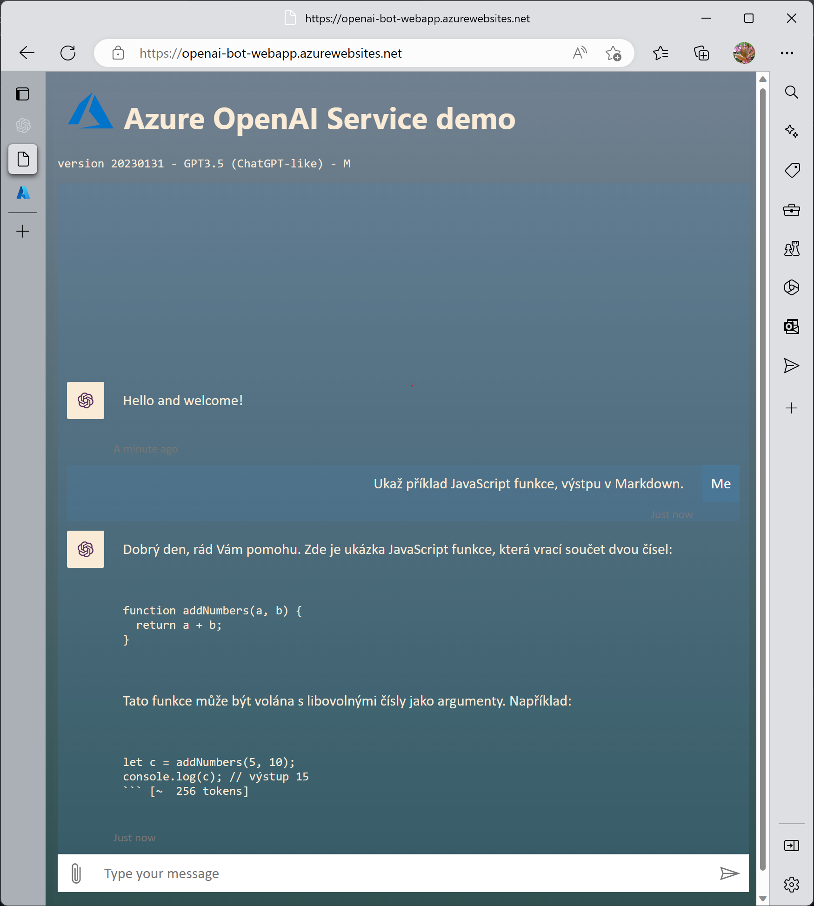

# Jednoduchý Chatbot s pomocí Azure OpenAI služby

## Úvod
Chatboty jsou počítačové programy, které slouží k vytváření interakce mezi lidmi a počítači. OpenAI `text-davinci` je moderní jazykový model založený na neuronových sítích, který byl vyvinut s cílem porozumět lidskému jazyku. Tento článek se zaměří na to, jak vytvořit účinný chatbot založený na [Azure OpenAI](https://learn.microsoft.com/en-us/azure/cognitive-services/openai/) `text-davinci` modelu.

V rodině OpenAI je dnes k dispozici monho modelů, které se navzájem liší svým zaměřením (přirozený jazyk, kód, obrázky), ale také komplexitou a tím co dokážou. Pěkný úvod a ukázka shrnutí (sumarizace) textu můžete najít na [blogu ](https://tomaskubica.cz/post/2023/azure-openai-service-sumarizace-textu-v-cestine/) Tomáše Kubici.

## Cíl

Cílem je vytvořit jednoduchý chatbot s použitím minimálního úsilí, tzn. budeme využívat služby a komponenty, které jsou již v zásadě připravené.

**Jaké komponenty takový chatbot bude mít?**

Chatovací logika - srdce chatbota je ve schopnosti reagovat na uživatelské podněty, dotazy a požadavky. Měl by pochopit na co se uživatel ptá, v případě nejasností se doptat na doplňující informace a poskytnout (pokud možno správnou) odpověď. Tady právě budeme spoléhat na Azure OpenAI službu.

Front-end, resp. GUI, bude nejspíš webová aplikace, která zprostředkuje komunikaci uživatele s vlastním chatbotem. Nicméně, často takový chatbot může mít takových interfaců více: část uživatelů komunikuje přes webové stránky, část může používat aplikaci v mobilu a další část může například komunikovat v rámci Teams platformy. To znamená, že chatbot využívá více kanalů - idealní samozřejmě je, pokud nemusím upravovat bot pro každý kanál zvlášť. 

Komunikaci skrz kanály bude poskytovat [Azure Bot Service](https://azure.microsoft.com/en-us/products/bot-services/#features), které umí vystavit a řídit komunikaci s různými kanály (Web/Direct, Teams, ale třeba taky Email, SMS, Slack atp. - více [zde](https://learn.microsoft.com/en-us/azure/bot-service/bot-service-channels-reference?view=azure-bot-service-4.0))

Použité služby a nástroje:
- Azure OpenAI - srdce / logika chatbota
- Azure App Service (Web App) - vystavení GUI a hosting chatbota
- Azure Bot Service - služba pro řízení komunikace přes různé kanály

## Architektura / Návrh řešení

Architektura je velmi jednoduchá, pro hostování bota slouží Azure Web App (App Service), která zároveň hostuje i webový forntend/aplikaci. A ta komunikuje pomocí Bot Service (direct channel). Uživatelské vstupy jsou tedy předávány do Azure OpenAI jako jednochué volání API.



Pojďme se teď podívat na implementaci takového řešení.

## Implementace

Postup je jednoduchý. Budeme maximálně využívat připravených template a příkladů,  

### Vytvoření OpenAI služby

V prním kroku vytvoříme OpenAI službu - k té je potřeba [vyplnit formulář](https://customervoice.microsoft.com/Pages/ResponsePage.aspx?id=v4j5cvGGr0GRqy180BHbR7en2Ais5pxKtso_Pz4b1_xUOFA5Qk1UWDRBMjg0WFhPMkIzTzhKQ1dWNyQlQCN0PWcu). V rámci této služby máme přístup na Azure OpenAI studio, kde můžeme začít výběrem a deploymentem modelu - `text-davinci-003`, což je model GPT3.5. Zároveň nabízí možnost "hracího hřiště" (playground), kde můžete modely testovat a zkoušet taky vlastní prompty.


### Vytvoření chatbota - úprava kódu

Druhý krok je tvorba vlastního bota v rámci Bot Frameworku, resp. vyjdeme z template pro jednoduchého web chatbota - [echo bot](https://github.com/microsoft/BotBuilder-Samples/tree/main/samples/typescript_nodejs/02.echo-bot). Já jsem si vybral JavaScript/TypeScript, ale můžete najít i příklad pro Python nebo C#.

V souboru `bot.ts` je vidět vlastní logika chat aplikace, my se zaměříme na `onMessage` metodu, která reaguje na příchod zprávy od uživatele.

```javascript
this.onMessage(async (context, next) => {
    const replyText = `Echo: ${ context.activity.text }`;
    await context.sendActivity(MessageFactory.text(replyText, replyText));
    // By calling next() you ensure that the next BotHandler is run.
    await next();
});
```

My tuto metodu upravíme tak, že uživatelský vstup (dotaz nebo povel) v proměnné `context.activity.text`, pošleme pro získání odpovědi do OpenAI služby a následně odpověď z OpenAI použijeme v odpovědi uživateli (`data.choices[0].text`):

```javascript
this.onMessage(async (context, next) => {
    
    const requestBody =     {
        prompt: context.activity.text
        , max_tokens: 500
        , temperature: 0.7
    };
    const data = await postDataToEndpoint(url, requestBody, headers);
    
    const replyText = `${ data.choices[0].text }`;

    await context.sendActivity(MessageFactory.text(replyText));
    
    // By calling next() you ensure that the next BotHandler is run.
    await next();
});
```

Tím ale ještě neznikne chatbot, kterého bychom chtěli - chybí nám dvě základní věci:
- chatbot osobnost - prompt
- uchování kontextu komunikace

**Jak na to?**

Práce s OpenAI textovými modely spočívá hlavně ve správném nastavení a vyladění promptu (více [zde](https://learn.microsoft.com/en-us/azure/cognitive-services/openai/how-to/completions)). Pro našeho chatbota použijeme prompt:

```
As an advanced chatbot, your primary goal is to assist users to the best of your ability. This may involve answering questions, providing helpful information, or completing tasks based on user input. In order to effectively assist users, it is important to be detailed and thorough in your responses. Use examples and evidence to support your points and justify your recommendations or solutions.

<conversation history>

User: <user input>
Chatbot:
```

V první části je instrukce jak se model bude k zadanému textu chovat - dávat odpovědi včetně příkladů na podporu rozhodování, doplňování. Zde se může objevit ladění osobnosti například: "chovej se profesionálně".

Pak náseleduje sekce `<conversation history>`, která drží historii konverzace a postupně ji doplňujeme o vstup a výstup chatbota. Tato část je důležitá proto, aby chat bot správně držel kontext komunikace.

Dále je `User: <user input>`, za což doplníme uživatelský vstup.


Celá funkce pak může vypadat takto:

```javascript
this.onMessage(async (context, next) => {
    
    // construct prompt
    let tmp_prompt = prompt.replace("<conversation history>", conversation_history).replace("<user input>", context.activity.text)
    
    // construct request
    const requestBody =     {
        prompt: tmp_prompt
        , max_tokens: 500
        , temperature: 0.7

    };

    // send request to OpenAI
    const data = await postDataToEndpoint(url, requestBody, headers);


    // update converstation historz
    conversation_history = conversation_history + "User: " + context.activity.text + "\nChatbot: " + data.choices[0].text + "\n"
    
    const replyText = `${ data.choices[0].text }`;

    await context.sendActivity(MessageFactory.text(replyText));
    
    // By calling next() you ensure that the next BotHandler is run.
    await next();
});
```

Takového chatbota můžeme vyzkoušet lokálně v [Bot Framework Emulator](https://github.com/microsoft/BotFramework-Emulator):


### Deployment do Azure

Když jsme otestovali, že nás chatbot poslouchá a odpovídá v lokálním prostředí, můžeme přistoupit k dalšímu kroku a to je  deployment do Azure. To děláme ze dvou důvodů:

1. potřebujeme aby byla služba přístupná odkudkoli 
1. chceme mít možnost pustit našeho chatbota na více kanálech

V případě, že používáme k vývoji [VS Code](https://code.visualstudio.com/) (což vřele doporučuju), můžeme využít rozšíření pro práci s Azure Web App k samotnému (1-click) deploymentu.


To je dobré pro jednorázové testování, pro snažší iterativní vývoj doporučuju využít možnosti [automatického deploymentu do Azure Web App pomocí GitHub Actions](https://learn.microsoft.com/en-us/azure/app-service/deploy-continuous-deployment?tabs=github).

### Konfigurace Azure / Bot Service

Bot jako takový (engine) je nyní již hostovaný v Azure - zbývá nám ještě vystavit jej pomocí [Azure Bot Service](https://portal.azure.com/#create/Microsoft.AzureBot) a získat tak přístup k více kanálů bez nutnosti změny kódu.

Stačí zadat adresu URL web aplikace vytvořené v minulém kroce do nastavení Bot service - taková URL je FQDN dané aplikace plus `api/messages`, tzn. vypadá nějak takto:

```url
https://YOUR-WEB-APP.azurewebsites.net/api/messages
```


Pokud vše bylo správně, můžeme rovnou otestovat v rámci Web Chat v rámci bot service služby přímo na Azure Portále:


Tímto jsme získali přístpu k použítí hned několika kanálů: Web Chat, Microsoft Teams, Facebook Messenger, Slack, Twilio SMS,... (celý seznam [zde](https://learn.microsoft.com/en-us/azure/bot-service/bot-service-channels-reference?view=azure-bot-service-4.0))


### Front-end / Webová aplikace

Teď když nám chatbot funguje a je deployovaný v Azure, můžeme vyzoušet nejčastější integrace do webové stránky. Nejjednodušší možnost je, že můžete si vygenrovat integraci pomocí `iframe` a tento kód pak jen vložit do vaší HTML stránky.

```html
<iframe src='https://webchat.botframework.com/embed/YOUR-BOT-NAME?s=YOUR_SECRET_HERE'  style='min-width: 400px; width: 100%; min-height: 500px;'>
</iframe>
```

Další varianta, je že přímo využijeme integraci WebChat do stránky - více [zde](https://learn.microsoft.com/en-us/azure/bot-service/bot-builder-webchat-overview?view=azure-bot-service-4.0) a zdroj je na: [https://github.com/microsoft/BotFramework-WebChat](https://github.com/microsoft/BotFramework-WebChat/tree/main/samples/01.getting-started/a.full-bundle). 

Ve zkratce se jedná o JS knihovny, které dovolují jednoduchou integraci a další úpravy vzhledu:

```html
<!DOCTYPE html>
<html>
   <body>
      <div id="webchat" role="main"></div>
      <script src="https://cdn.botframework.com/botframework-webchat/latest/webchat.js"></script>
      <script>
         window.WebChat.renderWebChat(
            {
               directLine: window.WebChat.createDirectLine({
                  token: 'YOUR_DIRECT_LINE_TOKEN'
               }),
               userID: 'YOUR_USER_ID'
            },
            document.getElementById('webchat')
         );
      </script>
   </body>
</html>
```

Kde `YOUR_DIRECT_LINE_TOKEN` je token pro direct line komunikaci v rámci Bot Service a `YOUR_USER_ID` vámi zvolená identifikace


Taková stránka pak obsahuje našeho právě připraveného chatbota. WebChat framework nabízí spoustu možností s úpravou vzhledu, takže můžete měnit téměř cokoli od barev po zpbrazení indikatorů členů konverzace - více [zde](https://learn.microsoft.com/en-us/azure/bot-service/bot-builder-webchat-customization?view=azure-bot-service-4.0).

Takže náš chatbot může vypadata třeba takto:



## Závěr

Toto byla ukázka, jak vytvořit jednoduchého chatbota, který ale zná odpověd na téměř jakokoli otázku :-), protože používá výkonný model `text-davinci-003` z Azure OpenAI služby. 

Pokud chcete, můžete si to sami vyzkoušet! Celý zdrojový kód je k dispozici na mém GitHubu: [https://github.com/michalmar/openai-demos-bot-webapp](https://github.com/michalmar/openai-demos-bot-webapp). Abyste mohli používat Azure OpenAI službu, je nutné o přístup nejdříve požádat - [formulář](https://customervoice.microsoft.com/Pages/ResponsePage.aspx?id=v4j5cvGGr0GRqy180BHbR7en2Ais5pxKtso_Pz4b1_xUOFA5Qk1UWDRBMjg0WFhPMkIzTzhKQ1dWNyQlQCN0PWcu). 
